```{css, echo=FALSE}
# CSS for including pauses in printed PDF output (see bottom of lecture)
@media print {
  .has-continuation {
    display: block !important;
  }
}
```

```{r setup, include=FALSE}
# xaringanExtra::use_scribble() ## Draw on slides. Requires dev version of xaringanExtra.

options(htmltools.dir.version = FALSE)
library(knitr)
opts_chunk$set(
  fig.align="center",  
  fig.height=4, #fig.width=6,
  # out.width="748px", #out.length="520.75px",
  dpi=300, #fig.path='Figs/',
  cache=T#, echo=F, warning=F, message=F
  )
library(tidyverse)
library(fixest)
library(pander)
library(RefManageR)
BibOptions(check.entries = FALSE,
           bib.style = "authoryear",
           style = "markdown",
           hyperlink = FALSE,
           dashed = TRUE)
#biblio <- ReadBib("../../References/References.bib", check = FALSE)
```

# Table of Contents

- [Prologue](#prologue)

- [Some basic guidelines](#some-basic-guidelines)
    - [Caveat](#caveat)

- [Tables](#tables)
    - [The Classics](#classic-tables)

- [Figures](#figures)
    - [The Classics](#classic-figures)
    - [Flashy](#flashy-figures)
    - [Data Visualization Checklist](#datavizchecklist)

- [Robustness Checks](#robustness-checks)

- [Get at it](#get-at-it)

---
class: inverse, center, middle
name: prologue

# Prologue

---
# Prologue

- Today we're going to chat about how to present your results

- I am assuming you've now gotten some really neat answers to your research question
    - Yes, I know many of you are still working on this, but it is still great to be forward looking

- Once you're knee-deep in your question and know a ton about it, it can be hard to remember what it was like to not know anything about it

- That's the integral step to presenting the results: **Remember your audience**

---
# Remember your audience

- Your audience is not you

- They have not spent a semester (or more) thinking about your question, the data, the institutional details, the econometric methods, etc.

- And most research projects will be bloated with results:
    - Tiny results
    - Big results
    - Results that are interesting to you but not to anyone else
    - Results that are interesting to everyone else but not to you

- So how do you present your results in a way that is informative, engaging, and not overwhelming?

---
# Why does this matter?

1. Almost all research is about advancing knowledge
    - If you don't communicate the results, you're not advancing knowledge

2. You want people to correctly understand your results 
    - Misunderstandings can lead to bad policy, bad business decisions, bad personal decisions, etc.

3. Good communication shows your work is honest and trustworthy
    - Most people don't have the time, expertise, or sometimes permission to replicate your results
    - They need to trust you
    - Clearly and concisely explaining your results is a way to build that trust

4. It feels great
    - Not for nothing, when you work hard on something cool, it feels great to show it off

---
name: some-basic-guidelines
class: inverse, center, middle
# Some basic guidelines

---
# Some basic guidelines

- Someone should be able to skim your figure and get the gist of the paper

- Have a main regression specification that you present front and center
    1. Don't bury it in appendix Z.4
    2. Any other results should **ideally** be "one change" from the main specification
        - Add a control; add an interaction; subset the sample

- Labels, labels, labels
    - Make sure your tables and figures are labeled    
    - Labels should be informative, but terse (not coding variable names)

- Do not present extensive details on something you are not going to talk about in your paper
    - Don't show me every coefficient for each control variable
    - Instead mention the controls in the note and if they  are included in a column

- Appendices are for robustness checks and additional details
    - They are not for the main results
    - They are for weird data quirks that you can explain in words and then provide in case someone is curious

---
name: caveat

# Caveat

- There are rules for what makes good tables and figures

- But they can be broken all the time because it makes sense in the context of the results

- I'll show several beautiful figures and tables, but they might not be the best for your specific results
    - Balance tables are great when you have a treatment/control group
    - But they don't really make sense in a time series context or with an instrumental variable

- Sometimes there is a second key result that needs to be a heavy shift from your main specification
    - For example, you may use a difference-in-difference design to show a macro effect, but then use a regression discontinuity design to show a micro effect
    - That's fine, but you should hold your readers hand and explain why you're doing this

---
name: tables
class: inverse, center, middle

# Tables

---
# Tables

## Basic rules for tables

1. **Title**: The title should be informative and placed at the top of the table

2. **Columns** and **Rows** should not be redundant, so the intersection of a column and a row (a cell) should be a unique feature/summary of the data

#### Caveat: The role of columns and rows can change, but they should not be redundant

3. **Caption**: The caption should be informative and placed at the bottom of the table
    - Ideally it has a brief description of the table and then a brief description of each column
    - It also lists any shorthand like "* for $p<0.05$, ** for $p<0.01$, etc.

4. **Labels**: The table should be labeled as transparently as possible

---
name: classic-tables

# The Classics

1. Summary statistic tables
    - Overview of the data
    - Often the least interesting table in the paper

2. Balance tables
    - Two-way t-test of treatment and control groups on observables (mandatory in RCTs)

3. Regression tables
    - The main specification
    - Robustness checks
    - Sub-sample analyses
    
4. Correlation tables
    - Rare

5. Customized tables
    - Often tables are customized to show a specific result

---
# Summary statistic tables

- The summary statistic table is often a mandatory table and usually the least interesting in the paper. 

- Increasingly, you'll see it punted to the appendix

- It is good to make (even if it isn't in the paper) because it makes sure you check your data

- But make it readable, informative, and not too long
    - There are literally infinite ways to summarize your data with statistics
    - Don't show me infinite summary statistics
    - Show me the ones that are most informative

- Think about how you can use dimensions of your data to present subsets that may or may not be interesting

---
# Summary statistics table

Ganong and Noel (2019) toss this summary statistics table in the appendix of their paper. Note they separate the table by meaningful categories of the data to guide the reader.

<center>
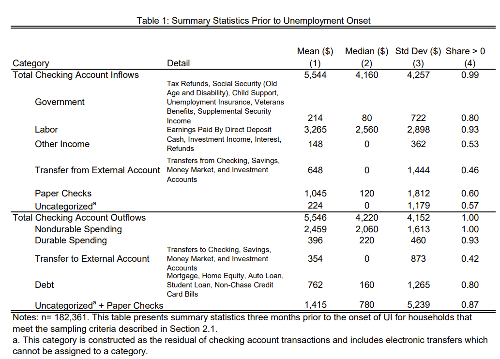
</center>

---
# Regression tables

- In general, every column should be a different regression specification and it should be obvious

- First specification should be the simplest specification, then each column should be a change from that
    - The changes may be cumulative: simplest, then add controls, then add fixed effects
    - The changes may be distinct by column: simplest, then add controls, then no controls but fixed effects

- Your specification change may just mean a new dependent variable, in which case label the column as such
    - Columns should be numbered

- Each row should be a key independent variable, then some summary information below:
    1. Standard error type, any clustering?
    2. $R^2$ or some other measure of fit
    3. $N$ for observations
    4. Are controls included (sometimes can go above line)
    5. What types of fixed effects in there?

---
# Regression table example

Note the way information is presented parsimoniously here! 

<center>
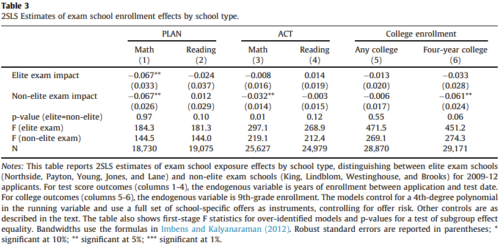
</center>

---
# Correlation tables

- These are rare to include, but basically each cell is a correlation coefficient

- The rows and columns are variables and the intersection is the correlation coefficient between the two

- They're easiest to make in coding languages and bothersome to make look nice for a paper

---
# Outputting tables

- Lots of software automates turning your messy output into a nice table
    - They generally have sensible defaults
    - And are customizable, but the more you customize the more you have to maintain
    - Use these because you should able to update your results easily (i.e. without a day spent editing numbers in tables)

- `esttab/estout` in Stata is great at outputting tables to LaTeX, Word, or Excel
    - `outreg2` is not bad either
    - You have to `ssc install` these

- R has loads of packages to output tables
    - **stargazer** is the most popular
    - **modelsummary** is great for linear models
    - **gtsummary** is great for summarizing models
    - **huxtable** works too
    - `etable()` in fixest is great if using that function
    - **xtable** is also popular
    - **kable** is the most flexible and can be used with **kableExtra** to make it look nice

- Python also has **stargazer**, etc.

---
class: inverse, center, middle
name: figures

# Figures

---
name: classic-figures

# Classic Figures

1. Scatter plots
2. Bin Scatter plots
3. Histogram/densities
4. Time series
5. Event study plots
6. Maps!

---
name: flashy-figures
# Great figures

- In general figures are better than tables
    - As a friend puts it, "Every table is a lie." I'd add "and some figures don't lie."

- Every once in awhile, an academic will ask people to [tweet their favorite figures](https://twitter.com/ProfNoto/status/973319310700699649)

- Sometimes these are just super crisp cause the data are crisp

- Sometimes they're great becausee the data are messy and the figure is a work of art

- Sometimes they're just really amusing

- I'm providing a few curated by [Paul Goldsmith-Pinkham](https://paulgp.github.io/best_figures.html) from a thread by Matt Notowidigdo

---
# Time series plots

Griliches (1957) clearly shows the S-curve in adoption of new technology spreading through a network.

<center>
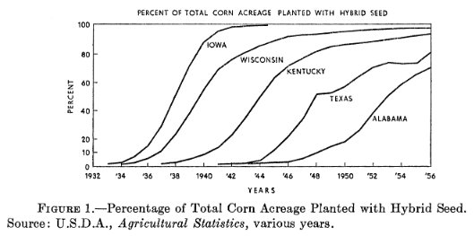
</center>

---
# Collapsing variation over time

Jensen (2007) shows variation in fish price collapses with the introduction of phones, which increased transmission of information.

<center>
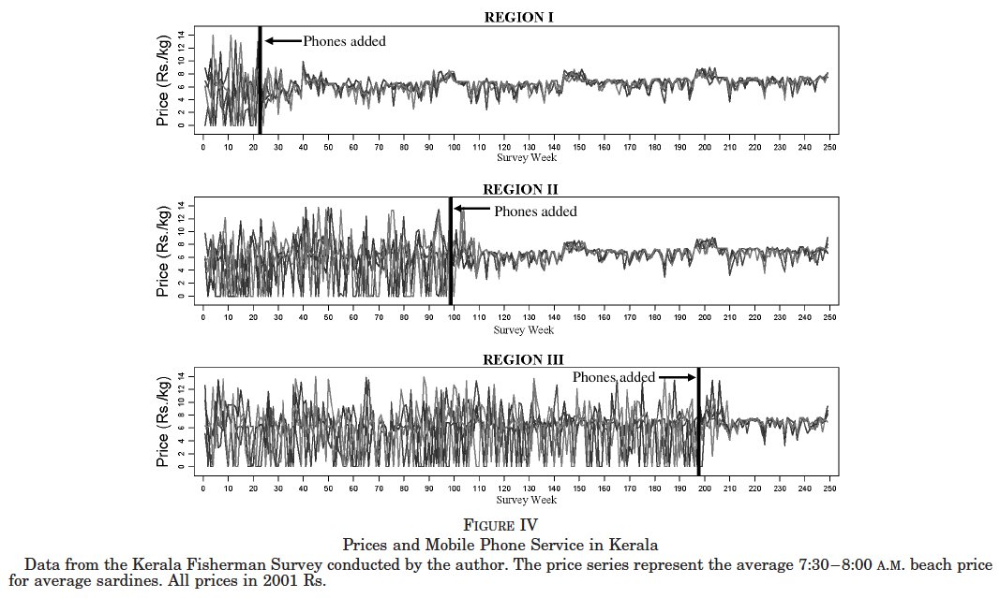
</center>

---
# Event study "like" plots

Kleven, Soogard, and Landais (2018) shows the evolution of earnings relative to just before having a child for future parents versus non-parents by parent gender.

<center>
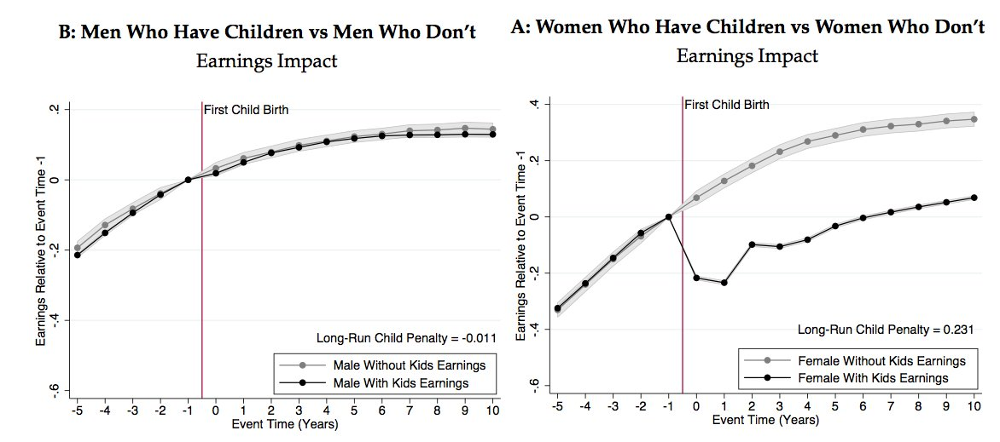 
</center>

---
# Event study by group to show variation

Stevenson and Wolfers (2006) show women's suicide rate drops off after unilateral divorce introduced, which intensifies as women age, then drops off as they reach old age.

<center>
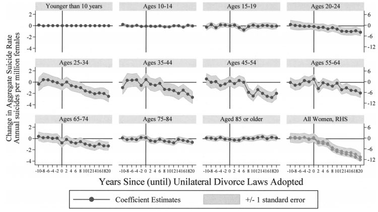
</center>

Personally, I don't love the choice to use only 1 standard error instead of a full 95% confidence interval, but it is good they honestly reported it.

---
# Placebo and effect event studies

Yagan (2015) shows C- and S-corp business practices move togethewr until a dividend tax cut led to more payouts to C-corp shareholders.

<center>
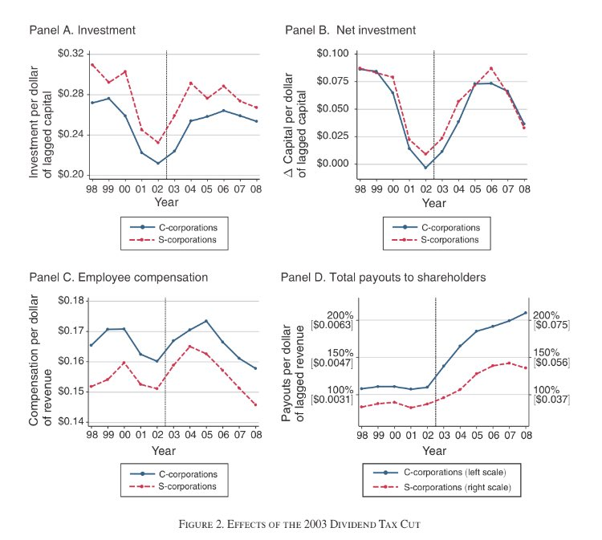 
</center>

---
# Show transitions around events

Card, Heining and Kline shows that movers from 1st quartile earning jobs to bottom quartile jobs see earnings fall accordingly and similar patterns across the board.

<center>
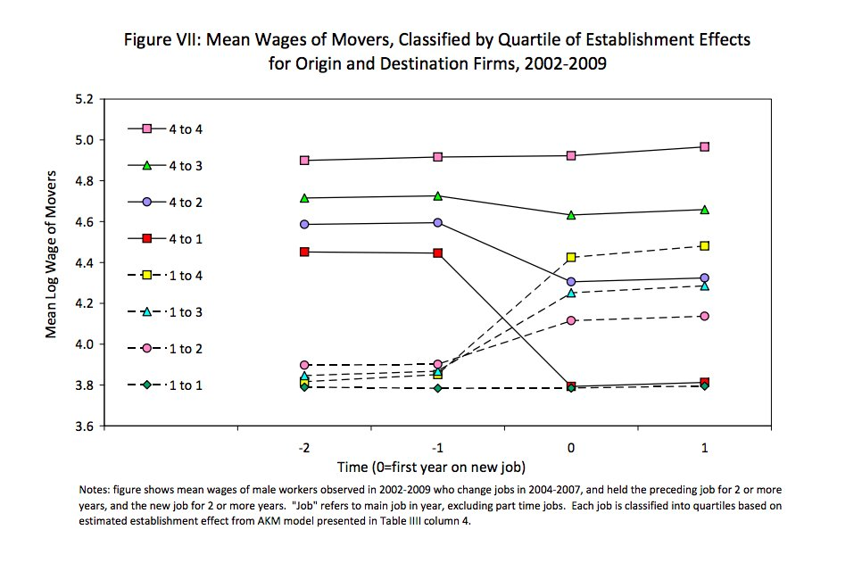 
</center>


---
# Scatter plots

- Great for showing relationships between two continuous variables

- Just raw visualization of every data point -- what's not to like if you have a small datasets

- But they get crowded quickly making them less useful for big datasets

- So we have binned scatter plots to help with that -- and there are some data-driven methods to figure out optimal binning so you don't obscure relationships

---
# Example from Michael Stepner

Michael Stepner's binscatter command (software in Stata, but also R). He shows binning the data from National Longitudinal Survey of Women (1988)

.pull-left[
<center>
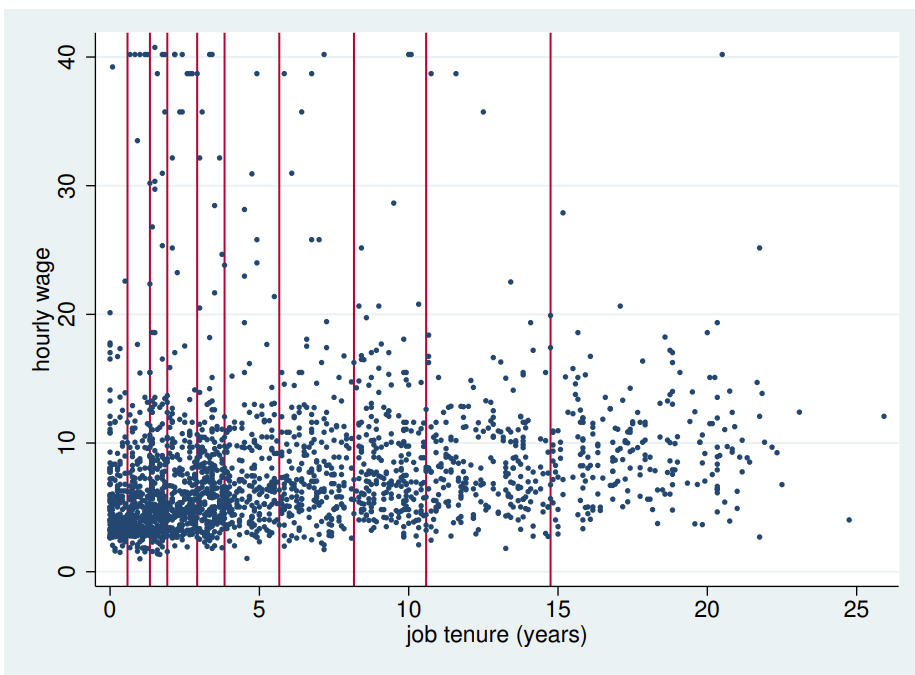
</center>
]
.pull-right[
<center>
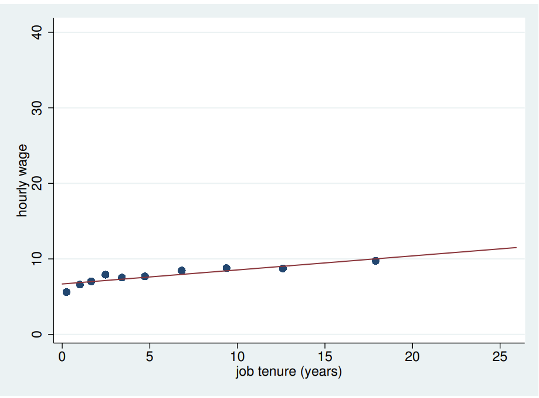
</center>
]

---
# Binscatter plot: RDD

Lee (2007) shows the incumbency advantage in elections in the US House of Representatives using election vote count as a predict of future probability of winning.
.pull-left[
<center>
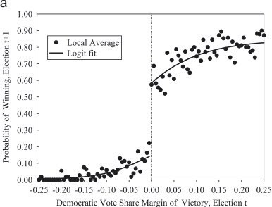
</center>
]
.pull-right[
<center>
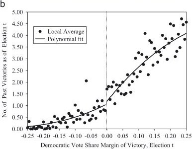
</center>
]

---
# Histogram/densities

- Best done for continuous variables

- Even if it does not make it to the final paper, it is a great way to check your data

- Does your dependent variable have a massive right-tail? 
    - If so, that outlier may drive your results! 
    - Check it is real and whether it is honest to present an average effect driven by a single outlier

- Does your sample match some other population of interest? 
    - If not, you may need to think about how to generalize your results
    - Or whether you should get specific with your results

---
# Population comparison

Coombs et al. (2021) compares our sample of Earnin users to the Current Population Survey to show a poorer population

<center>
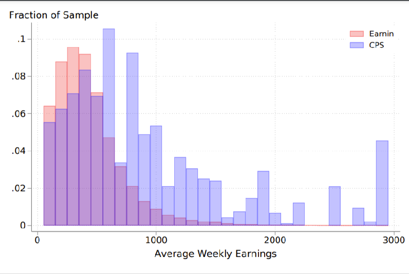
</center>

---
# Maps

Advanced is an interactive map like this one by Urban Institute: 

https://www.urban.org/research/publication/road-school-how-far-students-travel-school-choice-rich-cities-denver-detroit-new-orleans-new-york-city-and-washington-dc

---
# Don'ts and things to avoid

- Don't make elaborate 3D figures unless you must (they're hard to read and often misleading)

- Don't make pie charts
    - They're hard to read and often misleading
    - Use a bar chart to show the same information for categorical data and have an easy dimension (height) to compare size across categories
    - If you want to tell me the shares of something, just present a table

- Avoid y-axes that don't start at 0 (unless you have good reason)

- Avoid having a separate left and right y axis (unless you have a good reason)
    - I did this at the Federal Reserve a lot because I believe Janet Yellen liked them

- Lots of other don'ts: 
    - https://medium.economist.com/mistakes-weve-drawn-a-few-8cdd8a42d368
    - https://www.statisticshowto.com/probability-and-statistics/descriptive-statistics/misleading-graphs/

---
name: datavizchecklist
# Data Visualization Checklist

[Nick Huntington-Klein](https://nickch-k.github.io/DataVizChecklist/) offers a data visualization checklist

I encourage you to work through one figure/result you've been working on as I go through these slides

### Develop

1. Read the documentation for your data

2. Read the description of the variables you might use - what they are and what scale they’re measured in 

3. Figure out an interesting insight that you can convey with your data (the “story”)
    - Is it accurate? Does the data actually support that insight?
    - Is it actionable, deeply interesting, or does it help you understand how the world works? 
    - Ask "if I learned this insight, would I care?"" If the answer is no, try something else. 
    
- Tip: "Group X has the highest average value of variable Y" is a snooze of a story for most X and Y. If you’re going to do that one, you’re gonna have to work to convince the reader to care

---
# Data Visualization Checklist

### Design

1. What kinds of _continuity_ should the reader see 
    - "the poverty rate has fallen over time" means you can show continuous changes in time
    - "the poverty rate has fallen more in country X than country Y" means you need to contrast these changes time in X vs. Y

2. Determine the aesthetics you want to use to represent each relevant variable
    - Most figures have a meaningful X and Y axis, but maybe you want to use color, size, or shape to represent a 3rd, 4th, or 5th variable?
    - Continuity is best represented by the X or Y axis, though you can sometimes use color or size to represent a continuous variable
    - Categorical variables can be represented by any aesthetic

3. Determine the geometry that best tells the story
    - Line graphs require the X axis has an "order"
    - Scatter plots need continuous X and Y and cannot have too many points
    - Only certain geometries work well with many separate categories

4. Draw a quick sketch by hand

---
# Detail

1. Make an initial rough graph
2. Select aesthetic elements - colors, shapes, etc. - that are easy to read and colorblind-friendly (use [ColorBrewer](https://colorbrewer2.org/#type=sequential&scheme=BuGn&n=3) as a guide)
3. Label axes, legends, values in common-language terms and units (toss scientific notation)
4. Check the font size can be read by someone with reasonable vision -- this differs for presentations and figures
5. Move info to where it is easay to see - labels near data, legends on graph if possible, etc.
6. Add titles, highlighting, annotation, etc. to draw focus to the story
7. Remove any clutter you see that distracts
8. Ask (yourself or a friend), “if I didn’t know the story I was trying to tell, would I naturally figure it out by looking at the graph?” and if not, make it more clear.

---
# That sounds hard?

- Making good figures is hard work

- It is also the most satisfying once you get it right

---
class: inverse, center, middle
name: robustness-checks

# Robustness Checks

---
# Robustness Checks

I'm once again borrowing from [Nick Huntington-Klein](https://www.nickchk.com/robustness.html)

He gives a nice overview of the point of robustness checks. Here's my summary:

1. Robustness checks prod the assumptions of your main results

2. They don't confirm the asssumptions, but a good one can reject a null hypothesis that an assumption is true

---
# Robustness checklist

**Every time** you do a robustness test, you should be able to fill in the letters in the following list:

1. My analysis assumes .red[A].

2. If .red[A] is not true, then my results might be wrong in way .red[B [estimate too high/estimate too low/standard errors too small/etc...]].

3. I suspect that .red[A] might not be true in my analysis because of .red[C].

4. EITHER: .red[D] is a test of whether or not .red[A] is true,
OR: .red[D] is an alternate analysis I can run that does not assume .red[A], allowing me to see how big of a problem .red[B] is.

5. If it turns out that .red[[A is not true OR B is a big problem]], then I will do E instead of my original analysis.


---
# Common robustness checks

1. Change how you define your key outcome

2. Change how you define your sample (e.g. drop outliers, change sample selection criteria)
    - Require a balanced panel OR allow for unbalanced panel

3. Show placebo outcomes that should not be affected
    - If a reform should only affect people born after 1980, show that it does not affect people born before 1980

4. In the case of diff-in-diff, do you compare early treated to later treated (almost certainly if you use OLS)
    - Use tools like Goodman-Bacon decomposition to show how much these cases matter (or don't)
    - Try flashier specifications (stacked DiD is often the easiest) to see if the results change (often they don't)

#### Always change one thing at a time

Others by [Tatyana Deryugina](https://deryugina.com/some-tips-for-robustness-checks-and-empirical-analysis-in-general/)

---
# Let's think about diff-in-diff

- Plenty of diff-in-diff relies on a parallel trends assumption

- In the absence of treatment, the treatment and control groups would have followed the same trend

- But what if something changed in places that were treated that did not elsewhere?

- Well if you observe a "placebo" group who lives near the treated, but did not get treated, then you can use that group to residualize any potential changes
    - You add a third difference for this group
    - Or often just a time by geography fixed effect in your TWFE model (trust me it works)

---
# Example (taken from [Cunningham](https://causalinf.substack.com/p/triple-differences-part-1))

- Consider a state mandate of maternity benefits by Gruber that happens in some states -- what is the effect on women at the age that they can bear a child?

    - Treated group: women age 20-40 in states that mandate benefits
    - Control group: women age 20-40 in states that do not mandate benefits

- The specification is (not quite this):

$$\text{Wages}_{it} = \alpha + \beta \text{Post-Mandate}_{it} + \lambda_i + \lambda_t + \epsilon_{it}$$

---
# Results
class: white-slide

<center>
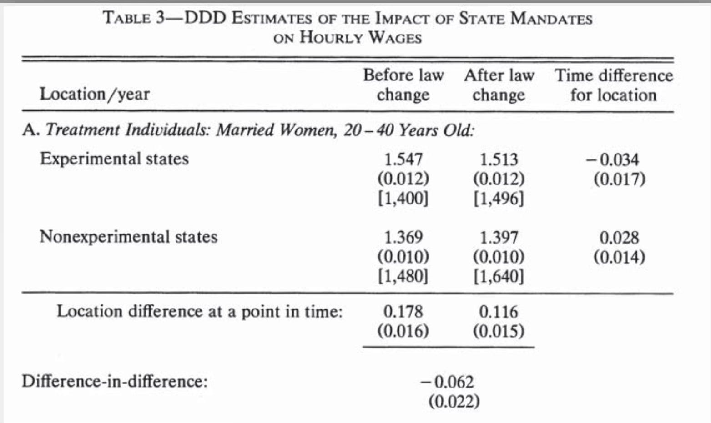
</center>

---
# But other things changed 

- This mandate didn't happen in a vaccuum, usually states made other changes

- For example, many states did this at a time when women's rights to join the labor force were increasing and there was some backlash

- Could it be that the backlash drove declines? Or perhaps the decline would be biger if this social change were not occurring?

- Well why not look at men of the same age who were not subject to the law? Perhaps they experienced social changes at the time, but not the mandate

- Do a diff-in-diff for this placebo group, subtract that out of the original diff-in-diff, and see if the effect changes

---
class: white-slide

<center>
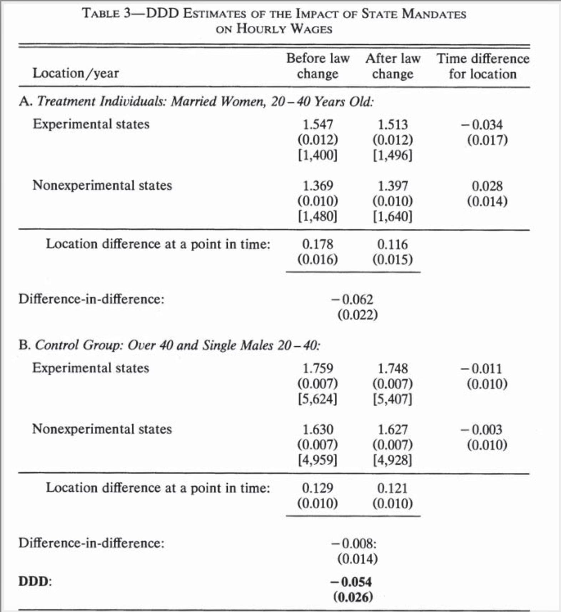
</center>

---
class: inverse, center, middle

# Next classes: One-on-ones and Student pitches
<html><div style='float:left'></div><hr color='#EB811B' size=1px width=796px></html>

```{r gen_pdf, include = FALSE, cache = FALSE, eval = TRUE}
infile = list.files(pattern = '.html')
pagedown::chrome_print(input = infile, timeout = 100)
```
